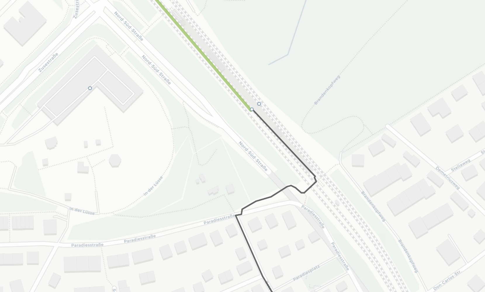
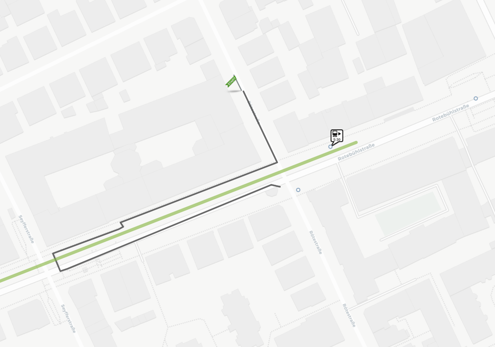
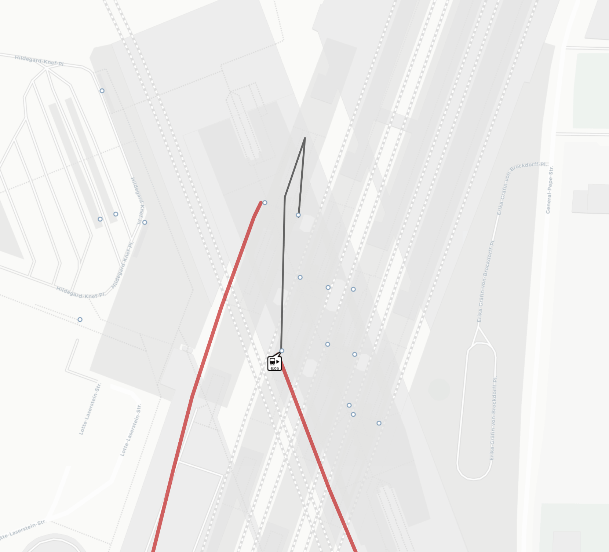
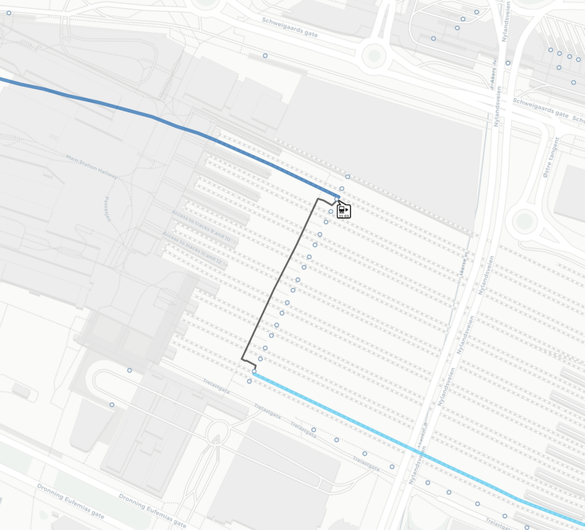

OTP offers a variety of ways to produce precise walking instructions
for walking inside a station or between transit stops.

### OSM generated navigation

In the most common case, the walking instructions for reaching a transit stop are generated from the
available OSM data. For this reason it is important that the coordinate of the stop is as close as 
possible to where the passenger is expected to wait for the vehicle, not where the vehicle will stop.

It is therefore a good idea to place the stop coordinates at a bus shelter or railway platform
rather than at the middle of the road or the railway tracks.

Of course you also want the data in OSM as precise as possible: data for railway platforms, stairs,
tunnels and other infrastructure help OTP to generate good walking instructions.

#### Example: exiting a railway platform

The train arrives in a [railway station in Stuttgart](https://www.openstreetmap.org/#map=19/48.73761/9.11627)
(green line), the passenger alights and is instructed (grey line) to walk along the platform,
up the stairs and across a [bridge](https://www.openstreetmap.org/way/22908778) to continue to 
their final destination.

### Boarding locations

If your stop coordinates are not very well-placed, OTP may direct passengers to the wrong waiting
location or offer incorrect transfer paths and time. As this a common problem and stop coordinates 
can be hard to change due to upstream systems, OTP offers a 
[way to derive the waiting coordinates](BoardingLocations.md) from OSM data.

Even if your stop coordinates are good, some stations are underground and to get correct walking 
instructions it's required to use this feature so that correct instructions for using entrances and
stairs are generated.

#### Example: walking downstairs to underground stations

This shows an underground [subway station in Stuttgart](https://www.openstreetmap.org/way/122569371)
which can only be reached by using entrances at either end walking down to the platform via
a series of stairs and walkways. OTP can only generate these detailed instructions because the platform
has a tag `ref:IFOPT` which identifies it in the German national stop register.

### GTFS pathways

If your GTFS input file contains [pathways](https://github.com/google/transit/blob/master/gtfs/spec/en/reference.md#pathwaystxt)
this will override the OSM-generated instructions. It is therefore important that the pathways
contain as much precision as possible.

One advantage that pathways offer is the possibility to add information like "follow signs for X"
which OTP adds to the textual turn-by-turn instructions.

#### Example: Transferring at Südkreuz

Here the pathways don't offer a lot of precision: In a [railway hub in Berlin](https://www.openstreetmap.org/#map=18/52.47572/13.36534&layers=T) 
there are suboptimal instructions on how to move from one platform to another because the pathways 
only contain rudimentary information about how to move inside the station. (The red lines represent 
train lines with the grey line showing the walking path.)

### Transfers

The above precedence rules of 

- GTFS pathways, if it exists
- then OSM data 

also apply when computing transfers from one stop to another.

#### Example: transferring from tram to rail at Oslo Central

Here the passenger arrives in a local tram (blue line) near the [main station in Oslo](https://www.openstreetmap.org/#map=17/59.90964/10.75503). They are 
instructed (grey line) to walk into the station right onto the correct platform and leave
on a long-distance train (red line).

#### Example: transferring between platforms at Oslo Central

This example instructs the passenger to get off a train, then walking down the stairs and via a tunnel
to another platform.

### Transfer time

The routing engine calculates the time to move from one stop to another by how long it thinks the
walking takes based on the navigation instructions outlined above. So, if OTP thinks that
it takes 5 minutes to walk from platform 1 to platform 8, then the routing algorithm will not suggest
a transit connection that departs less than 5 minutes after arriving at platform 1.

However, how fast the passenger is assumed to walk is controllable through the walk speed parameter.
This can be configured per installation or passed as an API call parameter.

The parameters [`alightSlack`](RouteRequest.md#rd_alightSlack), [`transferSlack`](RouteRequest.md#rd_transferSlack) 
and [`boardSlack`](RouteRequest.md#rd_boardSlack) also allow you to define extra buffer time
for transferring.

[GTFS minimum transfer times](https://github.com/google/transit/blob/master/gtfs/spec/en/reference.md#transferstxt) 
are also supported but generally not advised. It is preferable to micromap your stations and
improve the stop coordinates rather than force specific transfer times by adding this data.

### Common data errors

- Stop coordinates not where passengers are expected to board
- All stops/platforms in a railway station having the same coordinates
- OSM platforms [not connected to the street network](https://github.com/opentripplanner/OpenTripPlanner/issues/5029)